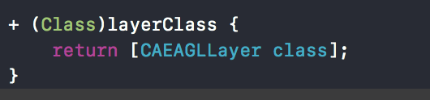
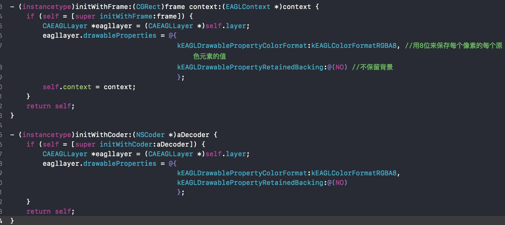
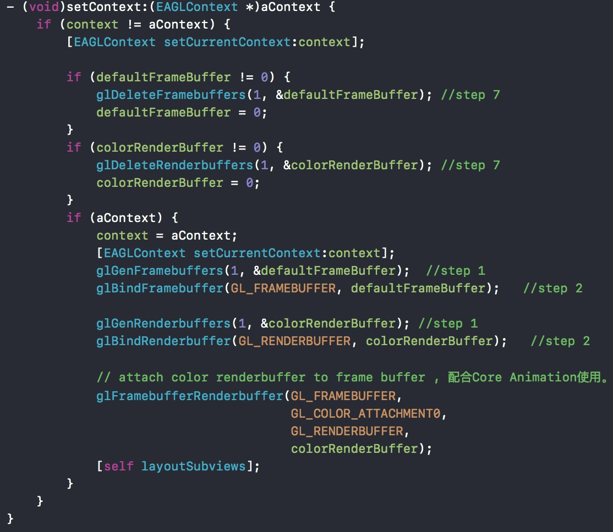
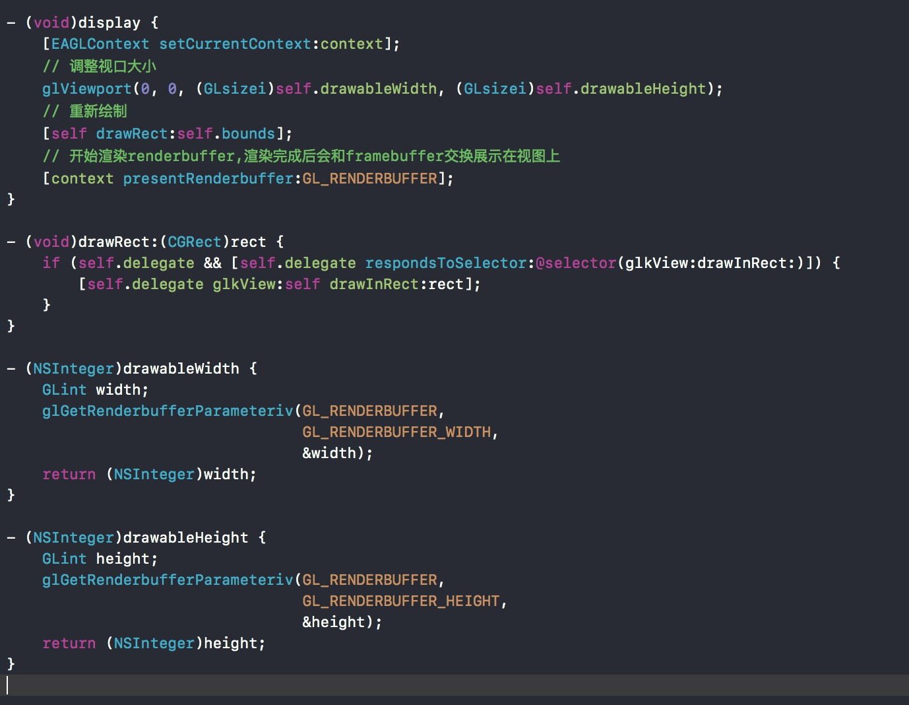
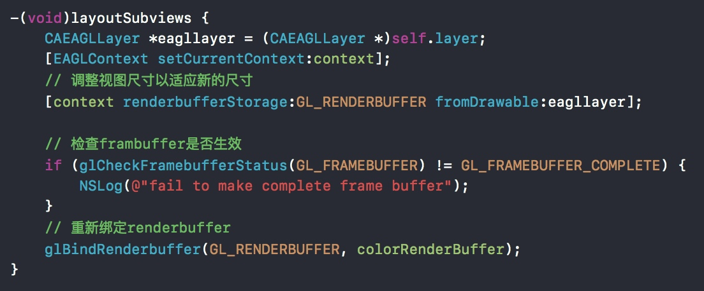

##GLKView&&GLKViewController实现
### GLKView
- 封装了帧缓存和管理层的逻辑。
### 自己实现GLKView
- GLKView 是继承自UIView的，我们尝试自己创建一个继承自UIView的FGLKView实现GLKView的功能。
- 每一个UIView都会有一个相关联的Cocoa touch自动创建Core Animation层，会调用`+layerClass`方法来确定需要创建什么类型的层。而GLKView返回的是一个CAEAGLLayer,我们需要重写这个方法
- 实现`- (instancetype)initWithFrame:(CGRect)frame context:(EAGLContext *)context`和重写`- (instancetype)initWithCoder:(NSCoder *)aDecoder`
- FGLKView 需要创建一个帧缓存和像素颜色缓存来和Core Animation一起作用，所以设置context会让之前的缓存失效，需要创建和配置新的缓存
- 实现`-(void)display`
- 因为帧缓存和像素缓存取决于视图的尺寸，而view可以调整尺寸，所以需要上下文`-renderbufferStorage:fromDrawable`来更新缓存。

