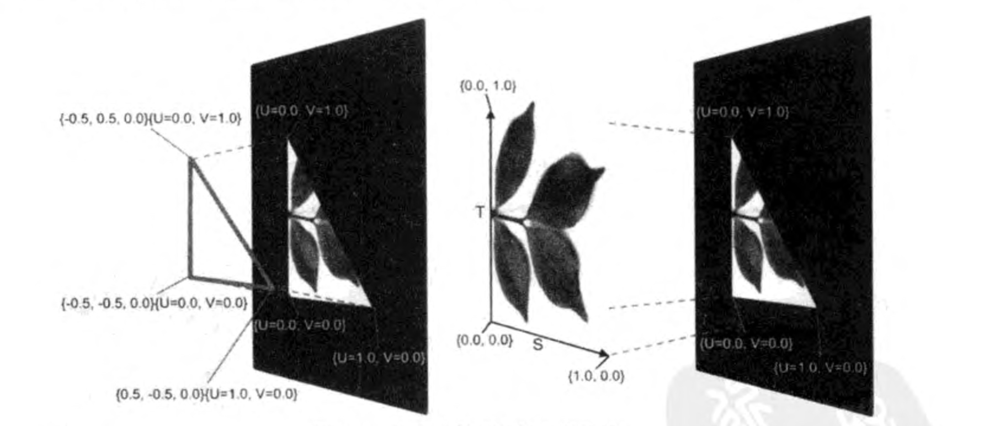
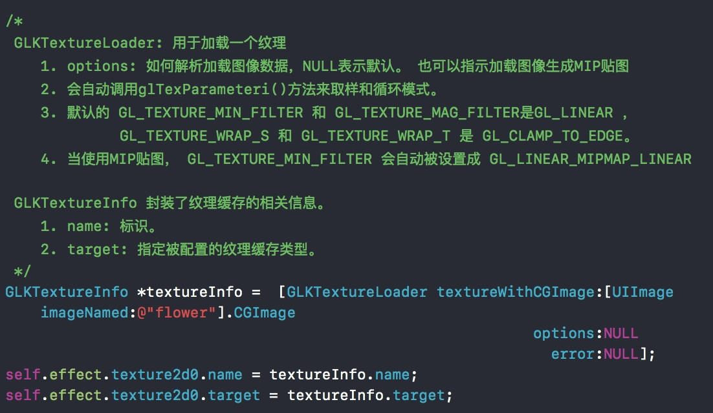

## 纹理
### 纹理基础概念
- 纹理是一个用来保存图像颜色元素值的OpenGL ES==缓存==。
- 纹理可以使用任何图像。
- 使用纹理回事渲染场景更加自然，会使三角形的复杂组合像是真实的物体面而不是只有颜色的面。
- 纹理的缓存中保存的颜色值可能要耗费很多的内存。所有的嵌入式的系统都为了纹理设定了内存的最大尺寸限制。由于嵌入式系统的可用内存相对较少，应该尽量的使用小的图像产生可以接受的渲染结果。
- 当一个图像初始化一个纹理缓存后，这个图像中的每个像素就变成了纹理中的一个==纹素（texel）==。与像素类似，纹素保存颜色数据。
- 像素表示计算机屏幕上的实际的颜色点，而纹素存在一个虚拟的没有尺寸的数学坐标系中。
- 纹理坐标系有一个命名为==S和T==的2D轴。在一个纹理中不管有多少个纹素，纹理的尺寸在S和T轴上永远是【0.1】。例子：从一个1像素高，64像素宽的图像初始化来的纹理会沿着T轴1个纹素，S轴64个纹素。

### OpenGL ES坐标和视口坐标
- 在GLKit01 的例子中，我们发现我们的顶点坐标围城的三角形和在屏幕上显示的三角形比例不对。这是因为我们使用的是OpenGL ES坐标系，这个例子的帧缓存是按照==像素==来匹配屏幕尺寸的。在渲染时，GPU会转换OpenGL ES坐标系中的每个顶点的x,y,z坐标为帧缓存中所对应的真实像素位置。帧缓存中的像素位置叫做视口（viewport）坐标。转换为视口坐标的结果是所有绘制的几何图形都会被拉伸来适合屏幕大小。
- 在每个顶点的x,y,z坐标被转换成视口坐标后，GPU会设置转换生成的三角形内的每个像素的颜色。

### 对齐纹理和几何图形
- 将几何形状数据 转换为 帧缓存中的颜色像素 的渲染过程叫做==点阵化（rasterizing）==，每个颜色像素叫做==片元（frament）==。
- 当没有使用纹理时，GPU会根据包含改片元对象的顶点的颜色来计算每一个片元的颜色。
- 程序通过对齐纹理和顶点让GPU知道每个片元的颜色由哪些纹素决定，这个对齐就叫做==映射==，是通过扩展每个顶点保存的数据来实现的：除了{x,y,z}坐标，每个顶点还给出了{U,V}坐标值。每个U坐标 会 映射 顶点在视口中的最终位置 到纹理中的沿着S轴的一个位置，V坐标映射到T。这句话比较拗口，通俗讲就是：顶点在视口中的最终位置，映射到纹理的S,T轴位置。下图更能形象的展示：

### 纹理的取样模式
- 每个顶点的U，V坐标会附加到 顶点坐标在视口中的最终位置，GPU通过计算每个片元的{U,V}位置，从绑定的纹理中选择纹素，这个过程就叫做取样。取样会将纹理{S,T}坐标系与每个渲染的三角形顶点的{U,V}匹配起来。
- OpenGL ES支持多个不同的取样模式。当一个有大量纹素的纹理被映射到了帧缓存内一个只覆盖了几个像素的三角形中，或者一个包含少量纹素的纹理被映射到了帧缓存中一个产生大量片元的三角形中。这样都会产生纹素的数量和需要被着色的片元的数量不匹配，这个时候就需要`glTexParameteri()`函数来配置每个绑定的纹理了。
- OpenGL ES取样模式：

### MIP贴图
- MIP贴图与取样密切相关。内存存取是现代图形处理的薄弱环节，当多个纹素对应一个片元的时候，线性取样会导致为了计算一个片元的最终颜色的值而读取多个纹素的颜色值。
- MIP贴图是为纹理存储多个==细节级别==的技术，高细节的纹理会沿着S轴和T轴存储很多的纹素，弟媳姐的纹理会沿着每个轴存很少的纹素（最少是1）。高细节级别会增加纹素和每个片元的U,V坐标之间紧密的对应关系的可能性。当存在一个紧密关系，GPU就会减少取样纹素的数量，进而减少内存访问次数。
- 使用MIP贴图会使每个纹理所需要的内存增加了1/3，是在以内存为代价 通过减少GPU取样的数量 来提高显然的性能。

### 使用纹理贴图
- GLKit03-纹理 项目中使用GLKTextureLoader 和GLKTextureInfo 用户纹理加载和保存纹理信息。

