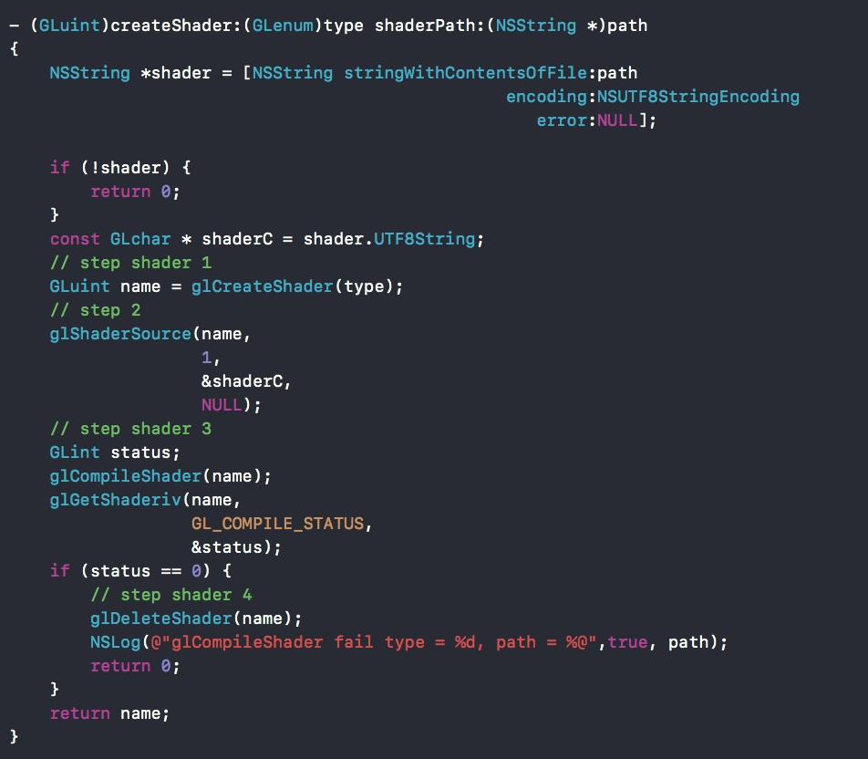

## 自定义纹理GLSL
- [着色器语言 GLSL (opengl-shader-language)入门大全](https://github.com/fushengit/GLSL-Card)
- GLSL使用：shader && program
	- shader加载4步
		- `glCreateShader()` 创建一个标识
		- `glShaderSource()` 标识链接GLSL文件
		- `glCompileShader()` 编译GLSL文件
		- `glDeleteShader()` 删除
		- 例如:
	- program 使用8步
		- `glCreateProgram()` 创建一个标识
		- `glAttachShader()` 绑定shader到program 
		- `glBindAttribLocation()；glGetUniformLocation()` 获取并设置uniforms,需要注意的是Bind必须在link之前。
		- `glLinkProgram()` 链接prograram
		- `glGetUniformLocation()；glUniformXXXX()` 获取uniform中相关值得索引,和给相关索引赋值。获取索引需要在link后使用，赋值需要在use后使用。
		- `glDetachShader()` 释放shader，配合`glDeleteShader()`一起使用
		- `glUseProgram` 使用Program,在渲染之前配合`glUniformXXX`使用
		- `glDeleteProgram()` 销毁program

- 本节相关内容较多，例子参考：GLKit07-自定义纹理

