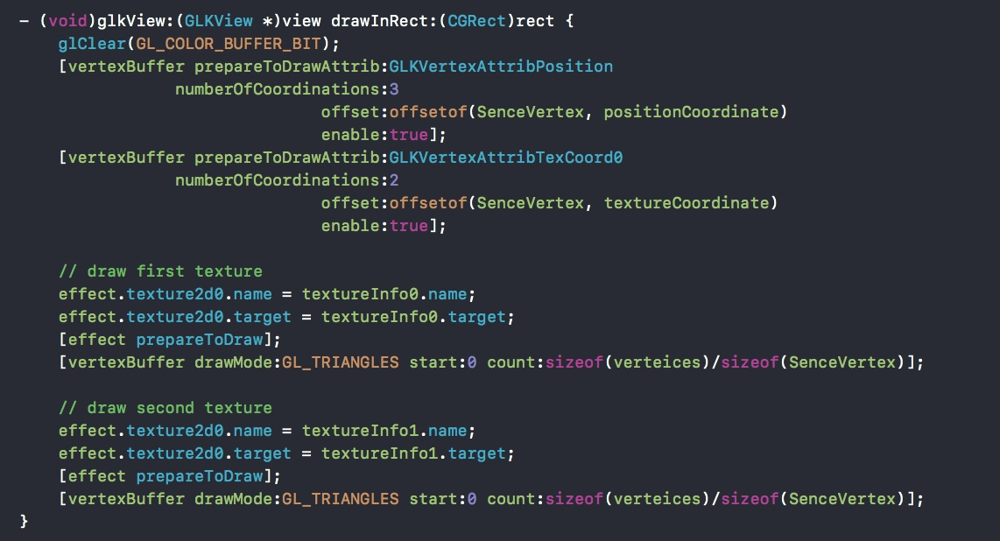
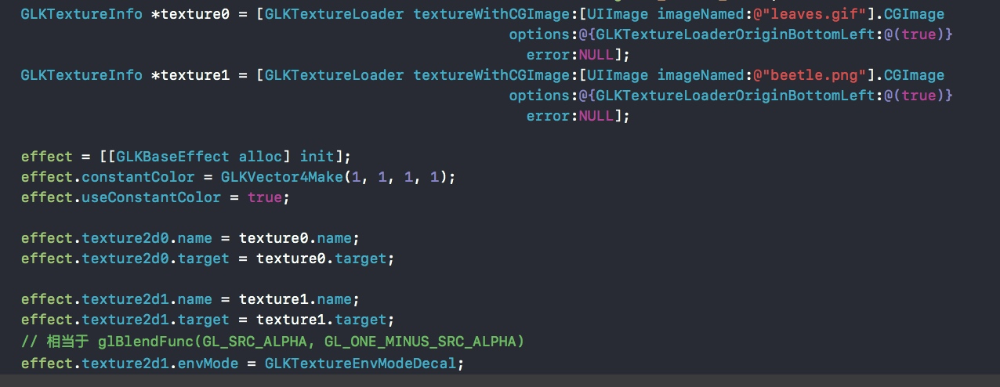
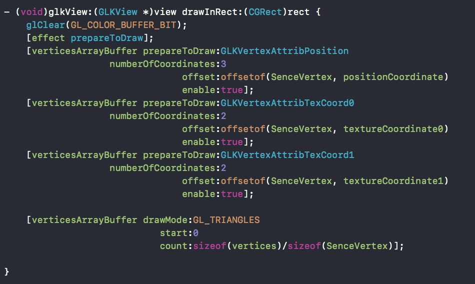

## 透明度、混合和多重纹理
### 透明度、混合
- 片元的==最终颜色==和==透明度==是由一个或多个纹素结合==灯光==和==顶点颜色==来决定的。每个片元产生的透明度都会影响片元怎么与一个帧缓存内的现存内容相混合。
	- 当片元的透明度是1时，将会直接替换帧缓存的像素颜色渲染缓存内现存的对应的像素颜色。
	- 当片元的透明度小于1是，OpenGL ES绘使用一个混合函数来混合片元颜色与像素颜色渲染缓存内现存的对应的像素颜色。 
	- 通过调用`glEnable(GL_BLEND)`来开启混合。
	- 通过调用`glBlendFunc(sourceFactor,desitnationFaction)`来设置混合函数。
		- sourceFactor：指定每个片元的最终颜色元素是怎么影响混合的。
		- desitnationFaction：指定在目标帧缓存中已经存在的颜色元素绘怎么影响混合。
	- 我们通常混合函数配置是`glBlendFunc(GL_SRC_ALPHA,GL_ONE_MINUS_ALPHA)`
		- GL_SRC_ALPHA 用于让片元的透明度元素挨个和其他片元颜色元素相乘。
		- GL_ONE_MINUS_ALPHA 用于让（1-透明度元素）和目标帧缓存中已经存在的颜色元素相乘。
		- 实际最终颜色就是用下面公式计算的：

### 多通道渲染
- 示例GLKit05中就用透明度混合的效果。核心代码如下：
- 利用透明度混合可以达到多个纹理混合的效果。但是这样由两个缺点：
	1. 每次渲染更新时，几何图形必须要被渲染一到更多次。
	2. 混合函数需要从像素颜色渲染缓存读取颜色数据以便和片元颜色混合，增加了内存的读取操作。
- 示例GLKit05中通过多次读写 像素颜色渲染缓存 来创建一个最终的 渲染像素 的过程叫做多通道渲染。内存访问限制了性能，因此多通道渲染是次优的。下面介绍多重纹理方法，它能避免多通道渲染的大部分缺陷。

### 多重纹理
- 现代GPU都能同时从至少两个纹理缓存中取样纹素。GLKBaseEffect类同时支持两种纹理。
- 执行纹素取样和混合的硬件组件叫做==一个纹理单元==或者==一个取样器==。
- 如果我们需要使用超过2个纹理单元，我们可以使用`glGetIntegerv(GL_MAX_TEXTURE_UNITS,&units)` 来确定一个单独的通道可以结合多少个纹理。
- 与多通道渲染不同，我们不需要重复绘制达到混合效果。例如：

